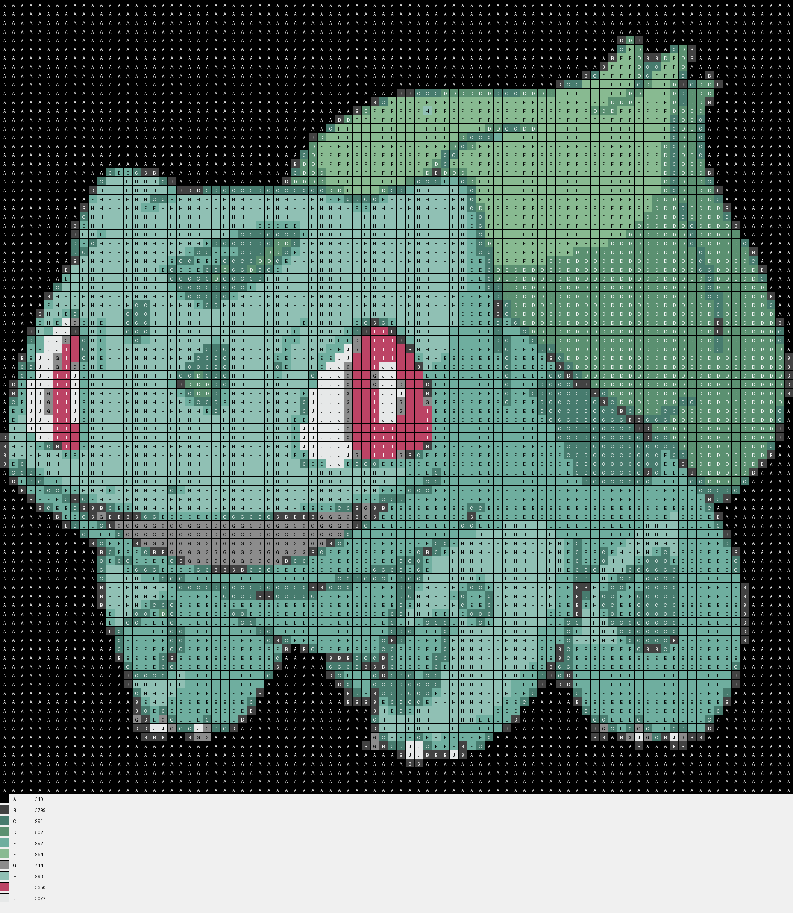

# PyStitch

A python program for converting images into a cross stitch pattern

## Prerequisites

- Python 3.12 or later
  - `brew install python@3.12` (macOS)
- UV (Python package manager)
  - [Install here](https://docs.astral.sh/uv/getting-started/installation)

## Installation

Clone the repository and install the required packages:

```bash
git clone git@github.com:angus-special-projects/PyStitch.git
cd PyStitch
```

Install the packages with UV...

```bash
uv sync
```

## Running the Program

### Using the Makefile

To run the program you can use the Makefile:

```bash
make run
```

### Manually

You can also run the program manually by executing the main script:

```bash
uv run python -m app.main
```

### Configuring the Program

You can configure the following settings in `main.py` ...

- `INPUT_PATH`: Path to the input image file.
- `OUTPUT_PATH`: Path to save the generated cross stitch pattern.
- `N_COLORS`: Number of colors to use in the pattern. The more colours, the more detailed the pattern will be, but it will require a greater selection of threads.

## Example Image


